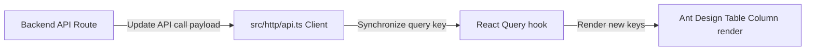

# 📊 mernspace-c-admin-ui - Core Developer Skill

Comprehensive development guidelines, state synchronization patterns, and UI standards for the **Vite React Admin Dashboard** of the Pizza Delivery Platform.

---

## 🧭 Repository Tech Stack

The Admin UI is a modern, high-performance dashboard for managers and global admins to view sales data, track active orders, configure menus, and manage tenants.

| Layer | Technologies & Libraries | Responsibility |
| :--- | :--- | :--- |
| **Build & Tooling** | Vite, TypeScript, ESLint | Extreme fast hot-reload development and optimized production bundling. |
| **Component Kit** | Ant Design (`antd`), `@design-icons` | Premium enterprise-grade table layouts, select dropdowns, responsive rows, cards, and modal forms. |
| **Navigation** | `react-router-dom` (v6 Browser Router) | Declares layouts and maps nested path views (HomePage, Users, Products, stores, Orders). |
| **State Management** | Zustand (with LocalStorage persist middleware) | Minimal, decoupled global stores for user sessions (`useAuthStore`) and light/dark mode triggers (`useThemeStore`). |
| **Data Fetching** | Axios, `@tanstack/react-query` | Server caching, background refetching, dynamic pagination, and local cache updates. |
| **Live Sync** | `socket.io-client` | Subscribes to store rooms and receives real-time order creations and status change events. |

---

## 💻 Directory Map & Structure

- [src/components](file:///e:/Hari/Desktop/Code/Pizza%20Delivery%20Platform/mernspace-c-admin-ui/src/components): Shared icons, layout fragments, and common buttons.
- [src/layouts](file:///e:/Hari/Desktop/Code/Pizza%20Delivery%20Platform/mernspace-c-admin-ui/src/layouts): Main shells: [Root.tsx](file:///e:/Hari/Desktop/Code/Pizza%20Delivery%20Platform/mernspace-c-admin-ui/src/layouts/Root.tsx), [Dashboard.tsx](file:///e:/Hari/Desktop/Code/Pizza%20Delivery%20Platform/mernspace-c-admin-ui/src/layouts/Dashboard.tsx) (with dark/light theme providers), and [NonAuth.tsx](file:///e:/Hari/Desktop/Code/Pizza%20Delivery%20Platform/mernspace-c-admin-ui/src/layouts/NonAuth.tsx) (login wall).
- [src/pages](file:///e:/Hari/Desktop/Code/Pizza%20Delivery%20Platform/mernspace-c-admin-ui/src/pages): Directory containing subpages with table grids and CRUD modals:
  - [orders/Orders.tsx](file:///e:/Hari/Desktop/Code/Pizza%20Delivery%20Platform/mernspace-c-admin-ui/src/pages/orders/Orders.tsx): Live orders feed with websocket listeners.
  - [orders/SingleOrder.tsx](file:///e:/Hari/Desktop/Code/Pizza%20Delivery%20Platform/mernspace-c-admin-ui/src/pages/orders/SingleOrder.tsx): Order details view and mutation status toggler.
  - [products/Products.tsx](file:///e:/Hari/Desktop/Code/Pizza%20Delivery%20Platform/mernspace-c-admin-ui/src/pages/products/Products.tsx): Products catalog list.
- [src/store.ts](file:///e:/Hari/Desktop/Code/Pizza%20Delivery%20Platform/mernspace-c-admin-ui/src/store.ts): Global Zustand state definition.
- [src/router.tsx](file:///e:/Hari/Desktop/Code/Pizza%20Delivery%20Platform/mernspace-c-admin-ui/src/router.tsx): Declarative path browser router.

---

## 🛡️ Coding Patterns & Standards

### 1. Programmatic React Query Invalidation & Cache Sync
When data changes, keep UI states synced by managing React Query's `useQueryClient` correctly:
* **Cache Invalidation on Update/Mutate**:
  After a status change, trigger `invalidateQueries` to automatically refetch stale states in the background:
  ```typescript
  const queryClient = useQueryClient();
  const { mutate } = useMutation({
      mutationFn: (status: OrderStatus) => changeStatus(orderId, { status }),
      onSuccess: () => {
          queryClient.invalidateQueries({ queryKey: ['order', orderId] });
      },
  });
  ```
* **Instant WebSocket Cache Injection**:
  To prevent unneeded database roundtrips, prepend new WebSocket orders directly into the cache using `setQueryData`:
  ```typescript
  queryClient.setQueryData(['orders'], (old: Order[]) => [newOrder, ...old]);
  ```

### 2. Secure WebSocket Listeners lifecycle
Real-time Socket.io listeners must be carefully mounted and unmounted within React `useEffect` loops to prevent memory leaks and repeated event captures.
* **Rule**: Always clean up listeners on component unmount:
  ```typescript
  React.useEffect(() => {
      socket.emit('join', { tenantId: user.tenant.id });
      socket.on('order-update', handleOrderUpdate);

      return () => {
          socket.off('join');
          socket.off('order-update');
      };
  }, []);
  ```

### 3. Declarative Ant Design Table Columns
Ant Design tables should rely on robust, typified `columns` lists declaring exact `render` operations for custom UI fields (e.g. mapping order statuses to custom tag colors, formatting raw date strings with `date-fns` `format()`, prepending rupee icons):
```typescript
const columns = [
    {
        title: 'Status',
        dataIndex: 'orderStatus',
        render: (_: boolean, record: Order) => (
            <Tag color={colorMapping[record.orderStatus]}>
                {capitalizeFirst(record.orderStatus)}
            </Tag>
        ),
    },
    {
        title: 'Total',
        dataIndex: 'total',
        render: (text: string) => <Typography.Text>₹{text}</Typography.Text>,
    }
];
```

---

## 🔄 Cross-Module Correlation Rules

If a backend service route payload or structure changes:


---

## ⚠️ Pitfalls, Edge Cases & Gotchas

> [!WARNING]
> ### 1. WebSocket Event Leakage
> Forgetting to return `socket.off()` in `useEffect` cleanly triggers massive duplication of notification badges and browser lags. Always return cleanup operations.

> [!IMPORTANT]
> ### 2. TypeScript Ignore on Nested Lists
> In `SingleOrder.tsx`, toppings lists are processed as `.map((topping) => topping.name)`. Since some components have custom configurations that might introduce dynamic nested arrays, pay attention to the types in `types.ts` and resolve type checks cleanly instead of excessively applying `@ts-ignore` overrides.

---

## 🧪 Testing & Verification Guidelines

- **Hermetic Vitest runners**:
  - Run `npm run test` to verify component rendering.
  - Rely on `@testing-library/react` to test forms, modals, and tables from a realistic user workflow (verifying that modal triggers display forms, table rows exist, and cancel button dismisses card).
