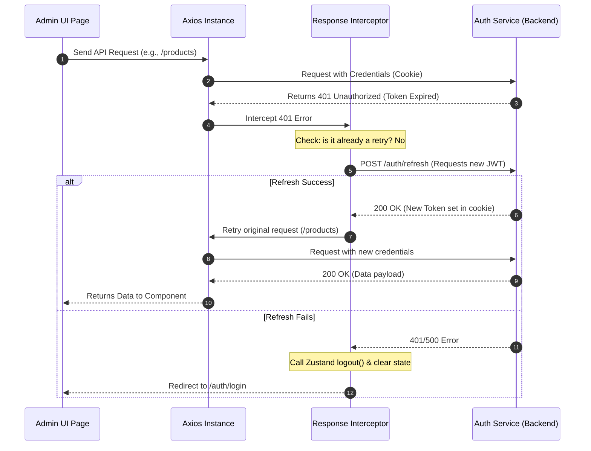
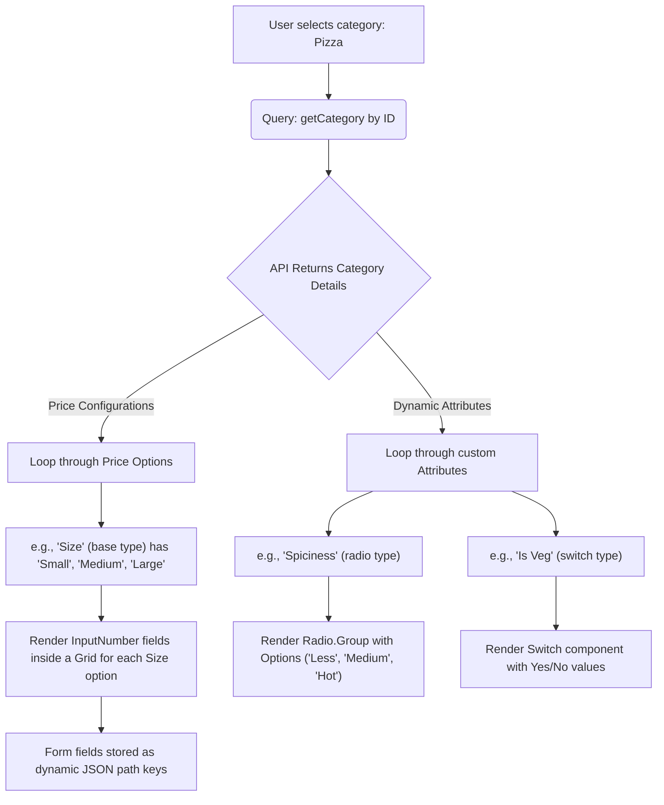
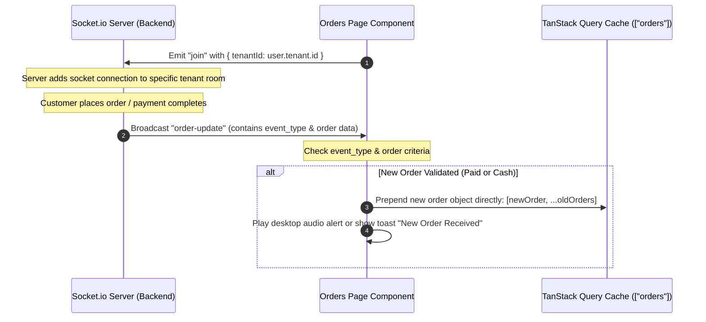

# Pizza Delivery Platform — Admin Dashboard UI (`mernspace-c-admin-ui`)

Welcome to the **Pizza Delivery Platform Admin Dashboard**, a premium, state-of-the-art administrative panel designed for franchise owners (Admins) and restaurant branch managers (Managers) to oversee catalog management, track real-time orders, and manage users/restaurants seamlessly.

This frontend application is built on a modern, ultra-responsive tech stack leveraging **React 18**, **TypeScript**, **Vite**, **Ant Design (v5)**, **TanStack React Query (v5)**, **Zustand**, and **Socket.io**.

---

## 🗺️ High-Level Architecture & Flow

The admin UI is structured around **microservices compatibility** and **role-based access control (RBAC)**. It communicates with back-end microservices (Auth, Catalog, and Order services) via an API Gateway/Proxy configuration.

### 📐 Structural Directory Layout

```
mernspace-c-admin-ui/
├── src/
│   ├── components/       # Reusable UI components & custom theme icons
│   ├── constants.ts      # Global configuration constants (pagination, colors, status maps)
│   ├── hooks/            # Custom React hooks (e.g., `usePermission` RBAC checks)
│   ├── http/             # API client layer (Axios instance, automatic token refresh interceptor)
│   │   ├── client.ts     # Axios instance & token refresh interceptor logic
│   │   └── api.ts        # Declarative API endpoints (Auth, Catalog, Orders)
│   ├── layouts/          # React Router layouts providing page shells and auth guards
│   │   ├── Root.tsx      # Entry guard — fetches active session `/auth/self`
│   │   ├── Dashboard.tsx # Sidebar layout for authenticated admins/managers
│   │   └── NonAuth.tsx   # Login page container (redirects authenticated users)
│   ├── lib/              # Client library initializations (e.g., socket.io-client)
│   ├── pages/            # Page components grouped by functional modules
│   │   ├── HomePage.tsx  # Dashboard overview page (sales metrics, list of recent orders)
│   │   ├── login/        # Sign-in page & credential validations (has unit test)
│   │   ├── orders/       # Order tracking grids, details, and real-time status updates
│   │   ├── products/     # Dynamic catalog menu management (with image upload)
│   │   ├── tenants/      # Restaurant franchise registry management
│   │   └── users/        # User role administration (Admin, Manager, Customer)
│   ├── store.ts          # Zustand state store managing global user credentials
│   ├── types.ts          # Strongly-typed TypeScript interfaces representing domain entities
│   ├── router.tsx        # React Router v6 browser routes configuration
│   └── main.tsx          # Application entry mount point (with QueryClientProvider & RouterProvider)
├── tsconfig.json         # TypeScript configuration
├── vite.config.ts        # Vite build tool and Vitest config
└── package.json          # Dependency packages and script configurations
```

---

## 🔑 Core Features & Data Flows

### 1. Robust Authentication & Session Management

The platform utilizes cookie-based JWT authentication with automatic background token refreshes, preventing session expiration for active managers.

#### 🔄 Token Refresh Interceptor Flow

If a backend request fails with a `401 Unauthorized` status (due to an expired access token), the custom Axios interceptor automatically requests a new token in the background and retries the original request transparently.



#### 🛡️ Page Guarding & RBAC
- **Root Layout (`Root.tsx`)**: Mounts first to fetch `/auth/self`. If found, stores user object globally in Zustand store (`useAuthStore`).
- **Dashboard Layout (`Dashboard.tsx`)**: Redirects users to `/auth/login?returnTo=...` if `user === null`. If logged in, filters sidebar items based on `user.role`:
  - **Managers** only see `Home`, `Products`, `Orders`, and `Promos`.
  - **Admins** additionally see `Users` and `Restaurants` (Tenants) management options.
- **Permission Hook (`usePermission.ts`)**: Ensures only `admin` and `manager` roles can sign in. If a customer attempts to sign in, they are immediately signed out.

---

### 🍕 2. Dynamic Catalog Management (Products & Categories)

A standout highlight is the dynamic, schema-driven catalog creator. Different food categories (Pizzas, Beverages, Sides) demand different pricing configurations and custom attributes. Rather than hardcoding these form fields, the UI dynamically constructs the creation and editing interfaces based on the selected category's schema.



#### 📁 Multiform Data Submission
Because menu items contain both binary files (images) and structured JSON configurations (pricing matrices & custom attributes), the app uses a helper utility (`makeFormData`) to construct a multi-part payload:
- Simple fields (name, description, categoryId) are appended as string fields.
- Nested configurations (`priceConfiguration`, `attributes`) are stringified to JSON strings.
- The product image is appended as a raw binary `File`.

---

### 📈 3. Live Order Tracking (Real-Time Websockets)

To let restaurants prepare orders instantly, the dashboard coordinates with the **Order service** and **Socket.io** gateway.



#### 🔔 Dynamic Status Controls
From the individual order details page (`/orders/:orderId`), managers can change the state of an order through a simple, visual dropdown. Each state change (e.g. changing from `Received` to `Confirmed`, then `Prepared`, `Out for Delivery`, and finally `Delivered`) triggers an API call that invalidates the local order query cache, ensuring everyone sees consistent data instantly.

---

### 🌗 4. Dark & Light Mode Theme Support

The application fully integrates a seamless **Dark & Light Mode theme switcher**, conforming to modern design aesthetics and enhancing usability in low-light restaurant environments.

* **Zustand-Powered Preference Storage**: The active theme preference (`isDarkMode`) is managed inside the centralized state store (`useThemeStore`) and persisted locally using Zustand's `persist` middleware, so the selected mode remains active across pages and browser refreshes.
* **Ant Design v5 CSS-in-JS Integration**: Swapping the theme toggles the active design algorithm inside `<ConfigProvider>` between `theme.defaultAlgorithm` and `theme.darkAlgorithm`. All Ant Design tokens, colors, borders, and backgrounds dynamically morph at runtime with smooth transitions.
* **Component-Level Theme Awareness**: Structural elements like the collapsible **Sider** and **Menu** automatically transition their internal styles (`dark` vs `light` mode) to match the dark aesthetic perfectly. A custom toggler switch equipped with Sun/Moon icons is beautifully placed inside the global dashboard Header.

---

## 🛠️ Technological Stack Breakdown

| Technology / Library | Purpose | Highlights in this Project |
| :--- | :--- | :--- |
| **Vite** + **TypeScript** | Build tool, bundler & static typing | Blazing fast HMR dev server; rigorous type-safety across API models |
| **Ant Design (v5)** | UI Components & Styling | Modern design language, dynamic drawers, responsive grid layout, theme hooks, and validation-ready Form systems |
| **TanStack React Query (v5)** | Server State Synchronization | Handles all asynchronous fetching, caching, loading skeletons, query pre-fetching, and instant cache-invalidation triggers |
| **Zustand** | Global Client State | Extremely lightweight state machine used to track the logged-in administrator's profile and active role |
| **Socket.io Client** | Real-Time Events | Keeps order lists perfectly up-to-date without polling, instantly notifying managers of new orders in their branch |
| **date-fns** | Date Formatting | Used for displaying customer order times and menu item creations in localized user-friendly structures |
| **Vitest** + **Testing Library** | Testing Suite | Provides high-confidence unit testing for crucial pages, validating UI fields and mock provider wrappers |

---

## 🚀 Setup & Execution Guide

### 📋 Prerequisites
Make sure you have **Node.js** (v18 or higher) and **npm** installed on your machine.

### 🔌 1. Configuration & Environments
Create a `.env` file in the root of the project directory (or modify the existing one):
```env
# URL where your Backend API Gateway / Proxy runs
VITE_BACKEND_API_URL=http://localhost:5501

# URL where the Real-time socket service runs
VITE_SOCKET_SERVICE_URL=http://localhost:5502
```

### 📦 2. Install Dependencies
Run the following command to install all the node packages:
```bash
npm install
```

### 💻 3. Run Development Server
Start the development server with Hot Module Replacement:
```bash
npm run dev
```
By default, the server will launch on `http://localhost:5173` (or the next available port).

### 🧪 4. Run Test Suites
Validate page structures and form controls using the Vitest test runner:
```bash
# Run tests in watch mode
npm run test

# Run a single coverage run
npx vitest run
```

### 🏗️ 5. Build for Production
Compile TypeScript and bundle assets into an optimized, minified production package:
```bash
npm run build
```
The build artifacts will be saved inside the `dist/` directory.

---

## 🔮 Edge Cases & Suggested Next Steps

1. **Dynamic Tenant IDs for Admins**:
   - *Current Behavior*: The `Orders` list page hardcodes a fallback `TENANT_ID = 10` for admins rather than letting them select which restaurant's orders they'd like to inspect.
   - *Suggested Improvement*: If `user.role === 'admin'`, render a select dropdown loaded with all registered restaurants (tenants). Selecting a restaurant will update the `tenantId` query parameter in the `orders` fetch query, providing a unified multi-restaurant overview.
2. **Search Debounce Integration**:
   - Search parameters (like `q`) on the users, tenants, and products lists have a built-in 500ms debounce buffer (using Lodash's `debounce`). This successfully saves backend resources and limits redundant request rates when admins type search strings.
3. **Graceful Error Handling in Forms**:
   - The forms in Drawers (such as `UserForm` and `ProductForm`) validate client inputs instantly before sending requests, keeping the system clean of invalid requests. When a server error occurs, errors are handled via React Query mutations and displayed gracefully through Ant Design's `Alert` or `message` components.
